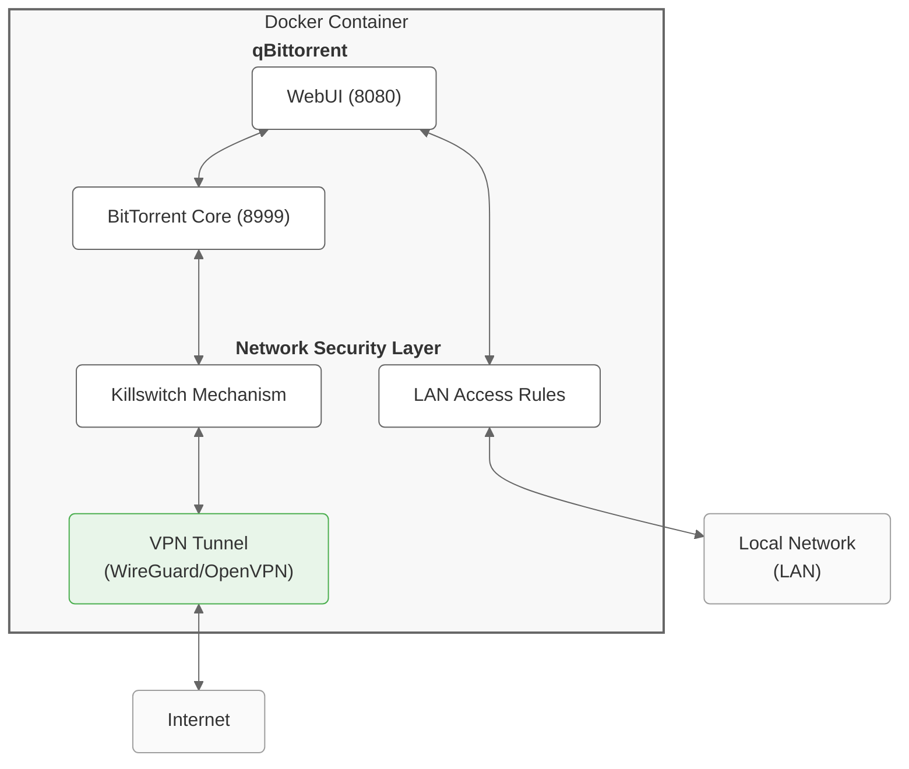

# qBittorrent with VPN

[![1] ![2]](https://github.com/emmorts/docker-qbittorrentvpn/pkgs/container/docker-qbittorrentvpn)

[1]: <https://ghcr-badge.egpl.dev/emmorts/docker-qbittorrentvpn/latest_tag?trim=major&label=latest>
[2]: <https://ghcr-badge.egpl.dev/emmorts/docker-qbittorrentvpn/size>

A lightweight Docker container running [qBittorrent](https://github.com/qbittorrent/qBittorrent) with WireGuard/OpenVPN support and built-in killswitch.

## Features

- Alpine Linux base (very small image size, see badge above)
- qBittorrent v5.0.5 with libtorrent (RC 1.2), compiled from source
- **WireGuard** and **OpenVPN** support
- iptables with a default `DROP` policy, ensuring qBittorrent traffic *only* goes through the VPN tunnel. LAN access to the WebUI remains allowed even if the VPN is down.
- Configures routing and firewall rules to prevent IP leaks. Includes DNS handling via `update-resolv-conf` for OpenVPN.
- Monitors VPN connection status and can restart the container on failure.
- Periodically checks latency, connectivity, MTU, and optionally download speed through the VPN tunnel.
- Configurable UID/GID for seamless file permissions
- Optional Python 3 support for scripts and plugins

## Quick Start

### WireGuard Setup (Recommended)

```bash
# 1. Create config directory and place your wg0.conf file
#    IMPORTANT: The filename MUST be exactly 'wg0.conf'
mkdir -p /path/to/config/wireguard
cp my-wireguard-config.conf /path/to/config/wireguard/wg0.conf

# 2. Launch container
docker run -d \
    --name=qbittorrent \
    -v /path/to/config:/config \
    -v /path/to/downloads:/downloads \
    -e "VPN_ENABLED=yes" \
    -e "VPN_TYPE=wireguard" \
    -e "LAN_NETWORK=192.168.0.0/24" \
    -p 8080:8080 \
    -p 8999:8999 \
    -p 8999:8999/udp \
    --cap-add NET_ADMIN \
    --sysctl "net.ipv4.conf.all.src_valid_mark=1" \
    --restart unless-stopped \
    ghcr.io/emmorts/docker-qbittorrentvpn:latest
```

### OpenVPN Setup

```bash
# 1. Create config directory and place your OpenVPN config
mkdir -p /path/to/config/openvpn
cp my-vpn-config.ovpn /path/to/config/openvpn/

# 2. Launch container with credentials
docker run -d \
    --name=qbittorrent \
    -v /path/to/config:/config \
    -v /path/to/downloads:/downloads \
    -e "VPN_ENABLED=yes" \
    -e "VPN_TYPE=openvpn" \
    -e "VPN_USERNAME=my_username" \
    -e "VPN_PASSWORD=my_password" \
    -e "LAN_NETWORK=192.168.0.0/24" \
    -p 8080:8080 \
    -p 8999:8999 \
    -p 8999:8999/udp \
    --cap-add NET_ADMIN \
    --restart unless-stopped \
    ghcr.io/emmorts/docker-qbittorrentvpn:latest

# Note: Setting VPN_USERNAME/PASSWORD automatically creates /config/openvpn/credentials.conf
#       and modifies your .ovpn file to use it via `auth-user-pass credentials.conf`.
#       See the "OpenVPN" section under "VPN Configuration" for alternatives.
```

Access the WebUI at `https://your-ip:8080` (or `http://` if `ENABLE_SSL=no`) with:
- Username: `admin`
- Password: `adminadmin`

## Architecture



The container runs qBittorrent and establishes a VPN connection. All internet-bound traffic from qBittorrent is forced through the VPN via strict `iptables` rules (default DROP policy on OUTPUT and INPUT chains, specific ACCEPT rules for VPN interface, loopback, related/established connections, and LAN access). If the VPN connection drops (`tun0` or `wg0` interface disappears or health checks fail), the firewall rules prevent any qBittorrent traffic from reaching the internet directly. Local network access to the WebUI (and other allowed ports) remains functional via the Docker network interface.

## Configuration

### Environment Variables

#### Core Configuration
| Variable | Description | Default | Required | Example |
|----------|-------------|---------|----------|---------|
| `VPN_ENABLED` | Enable VPN functionality and killswitch. Set to `no` to run without VPN (unsafe). | `yes`     | Yes                  | `yes`                           |
| `VPN_TYPE`    | Choose VPN protocol: `openvpn` or `wireguard`.                                    | `openvpn` | Yes (when VPN enabled) | `wireguard`                     |
| `LAN_NETWORK` | Your local network(s) in CIDR notation, comma-separated. Allows WebUI access.     | None      | Yes                  | `192.168.0.0/24,10.0.0.0/16`    |

#### VPN Configuration
| Variable | Description | Default | Required | Example |
|----------|-------------|---------|----------|---------|
| `VPN_USERNAME` | OpenVPN username | None | No (OpenVPN only) | `myusername` |
| `VPN_PASSWORD` | OpenVPN password | None | No (OpenVPN only) | `mypassword` |

#### Network Configuration
| Variable | Description | Default | Required | Example |
|----------|-------------|---------|----------|---------|
| `NAME_SERVERS`      | Comma-separated DNS servers to use inside the container.                                                                                | `1.1.1.1,8.8.8.8,1.0.0.1,8.8.4.4` | No       | `8.8.8.8,8.8.4.4`       |
| `LEGACY_IPTABLES`   | Force use of `iptables-legacy` instead of `iptables-nft`. Set to `yes` if your host system has issues with nftables (`xtables-legacy`). | `no`                              | No       | `yes`                   |
| `ADDITIONAL_PORTS`  | Comma-separated list of additional ports to open for **incoming** connections on the Docker interface (e.g., for plugins).              | None                              | No       | `9117,8112`             |

#### WebUI Configuration

| Variable                             | Description                                                                                                                                 | Default        | Required | Example                                     |
| ------------------------------------ | ------------------------------------------------------------------------------------------------------------------------------------------- | -------------- | -------- | ------------------------------------------- |
| `ENABLE_SSL`                         | Enable HTTPS for WebUI access. Generates self-signed certs if none exist at `/config/qBittorrent/config/WebUICertificate.crt` / `WebUIKey.key`. | `yes`          | No       | `no`                                        |
| `QBIT_AUTH_SUBNET_WHITELIST_ENABLED` | Enable/disable WebUI authentication bypass for specific subnets. If enabled, requests from whitelisted IPs skip user/pass checks.          | `true`         | No       | `false`                                     |
| `QBIT_AUTH_SUBNET_WHITELIST`         | Comma-separated list of subnets (CIDR) allowed to access WebUI without authentication *if* `QBIT_AUTH_SUBNET_WHITELIST_ENABLED=true`.          | `10.42.0.0/16` | No       | `192.168.1.0/24,10.0.0.0/8`                 |

#### File Permissions
| Variable | Description | Default | Required | Example |
|----------|-------------|---------|----------|---------|
| `PUID`   | User ID for the qBittorrent process and file ownership. See "User and Group Management" below.                                    | `1000`  | No       | `1001`  |
| `PGID`   | Group ID for the qBittorrent process and file ownership. See "User and Group Management" below.                                   | `1000`  | No       | `1001`  |
| `UMASK`  | File permission mask (octal) for files newly created by qBittorrent (e.g., downloads). `002` allows group write, `022` restricts it. | `002`   | No       | `022`   |

#### Health Checks
| Variable | Description | Default | Required | Example |
|----------|-------------|---------|----------|---------|
| `HEALTH_CHECK_HOST`            | Host to ping for basic network connectivity check.                                                            | `one.one.one.one` | No       | `8.8.8.8` |
| `HEALTH_CHECK_INTERVAL`        | Seconds between basic network connectivity checks.                                                            | `300`           | No       | `60`      |
| `HEALTH_CHECK_SILENT`          | Suppress periodic "Network is up" / detailed health check log messages unless an issue occurs. `0`=verbose.   | `1`             | No       | `0`       |
| `HEALTH_CHECK_AMOUNT`          | Number of pings to send during each basic connectivity check.                                                 | `1`             | No       | `3`       |
| `RESTART_CONTAINER`            | Automatically exit the container (triggering Docker restart policy) if the VPN health check fails persistently. | `yes`           | No       | `no`      |
| `VPN_QUALITY_CHECK_DISABLE`    | Disable the periodic detailed VPN quality monitoring (latency, MTU, connectivity tests).                      | `no`            | No       | `yes`     |
| `VPN_QUALITY_CHECK_INTERVAL`   | Seconds between detailed VPN quality checks.                                                                  | `3600`          | No       | `7200`    |
| `VPN_QUALITY_CHECK_SPEED`      | Include a small (~1MB) download speed test in the VPN quality check.                                          | `no`            | No       | `yes`     |

#### Additional Features
| Variable | Description | Default | Required | Example |
|----------|-------------|---------|----------|---------|
| `INSTALL_PYTHON3` | Install Python 3 package (`python3`) inside the container, e.g., for search plugins.       | `no`    | No       | `yes`   |

#### Troubleshooting
| Variable | Description | Default | Required | Example |
|----------|-------------|---------|----------|---------|
| `DEBUG` | Enable verbose debug logging in startup scripts | `false` | No | `true` |

### Volumes

| Volume       | Purpose                                                                                                   | Required | Notes                                                    |
| ------------ | --------------------------------------------------------------------------------------------------------- | -------- | -------------------------------------------------------- |
| `/config`    | Stores VPN configs (`/config/openvpn/` or `/config/wireguard/`) and qBittorrent settings/logs (`/config/qBittorrent/`). | Yes      | Essential for persistent configuration.                |
| `/downloads` | Default download location for qBittorrent.                                                                | Yes      | Main storage for downloaded files. Set permissions on host. |

### Ports

| Port | Protocol | Purpose | Notes |
|------|----------|---------|-------|
| `8080`    | TCP       | qBittorrent WebUI                                    | Secured with HTTPS by default unless `ENABLE_SSL=no`.            |
| `8999`    | TCP/UDP   | qBittorrent BitTorrent incoming connection listener. | Needs to be forwarded by your VPN provider to be effective.       |
| *Dynamic* | UDP       | OpenVPN/WireGuard connection establishment.        | Outgoing connection to your VPN server port (detected from config). |

Use the `ADDITIONAL_PORTS` environment variable to allow *incoming* connections to other ports within the container (e.g., for Jackett/Prowlarr access if running inside).

### User and Group Management (PUID/PGID)

The container attempts to run the qBittorrent process as the user and group specified by `PUID` and `PGID`.
- If a user with `PUID` or group with `PGID` already exists inside the container, it will use the existing ones.
- If they don't exist, it attempts to create a user (`qbittorrent`) and group (`qbittorrent`) with the specified IDs.
- If creation fails (e.g., ID conflict or other system issue), it logs warnings and may fall back to using the `nobody` user as a last resort.
- It's crucial to set `PUID` and `PGID` to match the owner of your `/config` and `/downloads` directories on the host system to avoid permission errors. Use `id $(whoami)` on your host to find your user's IDs.

### Important Notes

- **Host Network Mode:** Do **NOT** run this container in `host` network mode. It will break the killswitch and VPN routing. The container actively checks for and prevents startup if `host` mode (specifically, the `docker0` interface presence) is detected. Use `bridge` mode (Docker default).
- **IPv6:** IPv6 support is experimental. You may need to add IPv6 ranges to `LAN_NETWORK` and potentially add `--sysctl net.ipv6.conf.all.disable_ipv6=0` to your `docker run` or Compose file.

## VPN Configuration

### WireGuard (Recommended)

1. Place your `wg0.conf` in `/config/wireguard/`
2. **The filename MUST be exactly `wg0.conf`**. This is required for the `wg-quick` tooling and interface naming (`wg0`).
3. Set `VPN_TYPE=wireguard`.
4. Ensure the container has `NET_ADMIN` capability and the `net.ipv4.conf.all.src_valid_mark=1` sysctl set.
5. The script automatically extracts the `Endpoint` address and port for firewall rules.

Example WireGuard configuration format:
```ini
[Interface]
PrivateKey = your_private_key_here
Address = 10.2.0.2/32 # Your VPN internal IP
DNS = 10.2.0.1 # Optional: DNS server provided by VPN

[Peer]
PublicKey = server_public_key_here
Endpoint = vpn.example.com:51820 # VPN Server address and port
AllowedIPs = 0.0.0.0/0, ::/0 # Route all traffic through VPN
PersistentKeepalive = 25 # Optional: Keep connection alive
```

### OpenVPN

1. Place your OpenVPN configuration file (`.ovpn` or `.conf`) in `/config/openvpn/`. The container will automatically use the first one it finds.
2. Place any required certificate or key files (`.crt`, `.key`, `ca.crt`, `tls-auth.key`, etc.) referenced by your config file in the *same* `/config/openvpn/` directory. Ensure paths in the config are relative or point correctly within the container (e.g., `ca ca.crt`).
3. Set `VPN_TYPE=openvpn`.
4. **Authentication:**
    *   **Recommended:** Set the `VPN_USERNAME` and `VPN_PASSWORD` environment variables. The container will automatically create a `/config/openvpn/credentials.conf` file and modify your `.ovpn` config to use `auth-user-pass credentials.conf`, replacing or commenting out any existing `auth-user-pass` lines.
    *   **Alternative:** Manually create `/config/openvpn/credentials.conf` with username on the first line and password on the second. Ensure your `.ovpn` file contains the line `auth-user-pass credentials.conf`.
    *   **Embedded Certs/Keys:** Configs with inline certificates/keys (`<ca>`, `<cert>`, `<key>`) are supported directly.
5. **DNS Handling (`update-resolv-conf`):**
    *   If your `.ovpn` file contains directives like `script-security 2` and `up /etc/openvpn/update-resolv-conf`, `down /etc/openvpn/update-resolv-conf`, the container handles DNS automatically.
    *   It looks for a user-provided script at `/config/openvpn/update-resolv-conf`. If found, it copies it to `/etc/openvpn/` for use.
    *   If no user script is found, but the config references it, a *basic* `update-resolv-conf` script is generated automatically in `/etc/openvpn/` that handles common `dhcp-option DNS` and `dhcp-option DOMAIN` pushes from the VPN server.
    *   If your config doesn't reference `update-resolv-conf`, DNS might not be updated automatically via the VPN. You might need to rely on the `NAME_SERVERS` variable or modify your OpenVPN config.
6. The script automatically detects the remote server address, port, protocol (`tcp`/`udp`), and device type (`tun`/`tap`) from the config file for firewall rules.

## Docker Compose

```yaml
services:
  qbittorrent:
    container_name: qbittorrent
    image: ghcr.io/emmorts/docker-qbittorrentvpn:latest
    environment:
      - VPN_ENABLED=yes
      - VPN_TYPE=wireguard
      - LAN_NETWORK=192.168.0.0/24 # Adjust to your LAN
      # Permissions
      - PUID=1000 # Your user ID
      - PGID=1000 # Your group ID
      # OpenVPN Credentials (if VPN_TYPE=openvpn and not using manual credentials file)
      # - VPN_USERNAME=my_username
      # - VPN_PASSWORD=my_password
      # Health & Monitoring
      - HEALTH_CHECK_INTERVAL=60
      - VPN_QUALITY_CHECK_SPEED=yes
      - RESTART_CONTAINER=yes
      # WebUI
      - ENABLE_SSL=yes
      # - QBIT_AUTH_SUBNET_WHITELIST_ENABLED=true
      # - QBIT_AUTH_SUBNET_WHITELIST=192.168.1.0/24
      # Optional Features
      # - INSTALL_PYTHON3=yes
      # Troubleshooting
      # - DEBUG=true
    volumes:
      - ./config:/config # Mount your host config dir here
      - ./downloads:/downloads # Mount your host downloads dir here
    ports:
      - 8080:8080
      - 8999:8999
      - 8999:8999/udp
    cap_add:
      - NET_ADMIN # Required for VPN and iptables manipulation
    sysctls:
      # Required for WireGuard
      - net.ipv4.conf.all.src_valid_mark=1
      # Optional: Enable IPv6 support within the container (if your VPN/network supports it)
      # - net.ipv6.conf.all.disable_ipv6=0
    restart: unless-stopped
```

Remember to create the `./config` and `./downloads` directories on your host before running `docker-compose up -d`. Place your `wg0.conf` or `.ovpn` file inside `./config/wireguard` or `./config/openvpn` respectively.

## Support

For issues and feature requests, please [open an issue](https://github.com/emmorts/docker-qbittorrentvpn/issues) on GitHub.

## Credits

This project is a fork of [DyonR/docker-qbittorrentvpn](https://github.com/DyonR/docker-qbittorrentvpn) with significant improvements in size optimization, reliability, and error handling.
