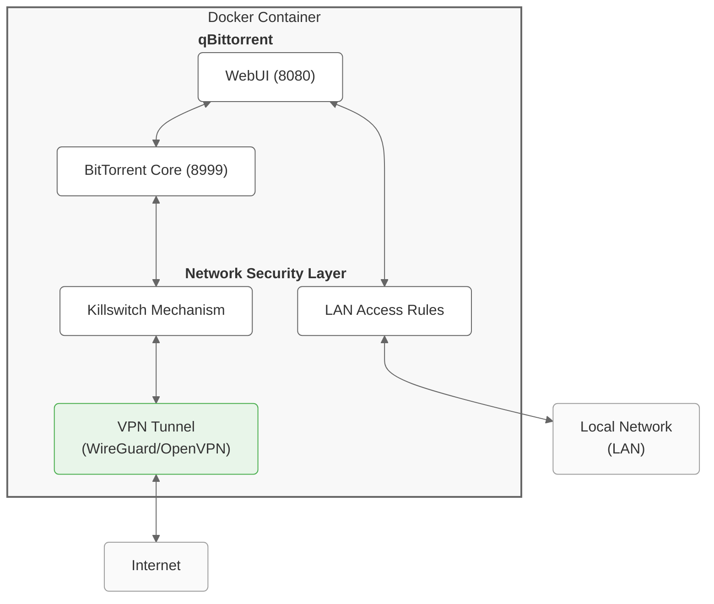

# qBittorrent with VPN

[![1] ![2]](https://github.com/emmorts/docker-qbittorrentvpn/pkgs/container/docker-qbittorrentvpn)

[1]: <https://ghcr-badge.egpl.dev/emmorts/docker-qbittorrentvpn/latest_tag?trim=major&label=latest>
[2]: <https://ghcr-badge.egpl.dev/emmorts/docker-qbittorrentvpn/size>

A lightweight Docker container running [qBittorrent](https://github.com/qbittorrent/qBittorrent) with WireGuard/OpenVPN support and built-in killswitch.

## Features

- Alpine Linux base (very small image size, see badge above)
- qBittorrent v5.0.5 with libtorrent (RC 1.2), compiled from source
- WireGuard and OpenVPN support with automatic killswitch
- Comprehensive network isolation and leak protection
- Detailed health checks and VPN quality monitoring
- Configurable UID/GID for seamless file permissions
- Optional Python 3 support for scripts and plugins

## Quick Start

### WireGuard Setup (Recommended)

```bash
# 1. Create config directory and place your wg0.conf file
mkdir -p /path/to/config/wireguard
cp my-wireguard-config.conf /path/to/config/wireguard/wg0.conf

# 2. Launch container
docker run -d \
    --name=qbittorrent \
    -v /path/to/config:/config \
    -v /path/to/downloads:/downloads \
    -e "VPN_ENABLED=yes" \
    -e "VPN_TYPE=wireguard" \
    -e "LAN_NETWORK=192.168.0.0/24" \
    -p 8080:8080 \
    -p 8999:8999 \
    -p 8999:8999/udp \
    --cap-add NET_ADMIN \
    --sysctl "net.ipv4.conf.all.src_valid_mark=1" \
    --restart unless-stopped \
    ghcr.io/emmorts/docker-qbittorrentvpn:latest
```

### OpenVPN Setup

```bash
# 1. Create config directory and place your OpenVPN config
mkdir -p /path/to/config/openvpn
cp my-vpn-config.ovpn /path/to/config/openvpn/

# 2. Launch container with credentials
docker run -d \
    --name=qbittorrent \
    -v /path/to/config:/config \
    -v /path/to/downloads:/downloads \
    -e "VPN_ENABLED=yes" \
    -e "VPN_TYPE=openvpn" \
    -e "VPN_USERNAME=my_username" \
    -e "VPN_PASSWORD=my_password" \
    -e "LAN_NETWORK=192.168.0.0/24" \
    -p 8080:8080 \
    -p 8999:8999 \
    -p 8999:8999/udp \
    --cap-add NET_ADMIN \
    --restart unless-stopped \
    ghcr.io/emmorts/docker-qbittorrentvpn:latest
```

Access the WebUI at `https://your-ip:8080` with:
- Username: `admin`
- Password: `adminadmin`

## Architecture



The container runs qBittorrent and routes all torrent traffic through the VPN tunnel while allowing local network access to the web interface. If the VPN connection drops, the killswitch activates instantly and blocks all internet traffic to/from qBittorrent. Meanwhile, you can still access the WebUI because LAN connections remain allowed.

## Configuration

### Environment Variables

#### Core Configuration
| Variable | Description | Default | Required | Example |
|----------|-------------|---------|----------|---------|
| `VPN_ENABLED` | Enable VPN functionality | `yes` | Yes | `yes` |
| `VPN_TYPE` | Choose VPN protocol | `openvpn` | Yes (when VPN enabled) | `wireguard` |
| `LAN_NETWORK` | Your local network(s) in CIDR notation | None | Yes | `192.168.0.0/24,10.0.0.0/16` |

#### VPN Configuration
| Variable | Description | Default | Required | Example |
|----------|-------------|---------|----------|---------|
| `VPN_USERNAME` | OpenVPN username | None | No (OpenVPN only) | `myusername` |
| `VPN_PASSWORD` | OpenVPN password | None | No (OpenVPN only) | `mypassword` |

#### Network Configuration
| Variable | Description | Default | Required | Example |
|----------|-------------|---------|----------|---------|
| `NAME_SERVERS` | DNS servers to use | `1.1.1.1,8.8.8.8` | No | `8.8.8.8,8.8.4.4` |
| `LEGACY_IPTABLES` | Use legacy iptables | `no` | No | `yes` |
| `ADDITIONAL_PORTS` | Open additional ports | None | No | `9117,8112` |

#### WebUI Configuration
| Variable                                | Description                                      | Default               | Required | Example                                |
|-----------------------------------------|--------------------------------------------------|-----------------------|----------|----------------------------------------|
| `QBIT_AUTH_SUBNET_WHITELIST_ENABLED`    | Enable/disable WebUI authentication whitelist    | `true` | No       | `false`                                 |
| `QBIT_AUTH_SUBNET_WHITELIST`            | Comma-separated list of subnets (CIDR) for WebUI | `10.42.0.0/16` | No       | `192.168.1.0/24,10.0.0.0/8`           |

#### Security Configuration
| Variable | Description | Default | Required | Example |
|----------|-------------|---------|----------|---------|
| `ENABLE_SSL` | Enable HTTPS for WebUI | `yes` | No | `no` |

#### File Permissions
| Variable | Description | Default | Required | Example |
|----------|-------------|---------|----------|---------|
| `PUID` | User ID for file ownership | `1000` | No | `1001` |
| `PGID` | Group ID for file ownership | `1000` | No | `1001` |
| `UMASK` | File permission mask | `002` | No | `022` |

#### Health Checks
| Variable | Description | Default | Required | Example |
|----------|-------------|---------|----------|---------|
| `HEALTH_CHECK_HOST` | Host to ping for connection testing | `one.one.one.one` | No | `8.8.8.8` |
| `HEALTH_CHECK_INTERVAL` | Seconds between checks | `300` | No | `60` |
| `HEALTH_CHECK_SILENT` | Suppress "Network is up" messages | `1` | No | `0` |
| `HEALTH_CHECK_AMOUNT` | Number of pings per check | `1` | No | `3` |
| `VPN_QUALITY_CHECK_DISABLE` | Disable VPN quality monitoring | `no` | No | `yes` |
| `VPN_QUALITY_CHECK_INTERVAL` | Seconds between quality checks | `3600` | No | `7200` |
| `VPN_QUALITY_CHECK_SPEED` | Enable throughput testing | `no` | No | `yes` |
| `RESTART_CONTAINER` | Auto-restart on network failure | `yes` | No | `no` |

#### Additional Features
| Variable | Description | Default | Required | Example |
|----------|-------------|---------|----------|---------|
| `INSTALL_PYTHON3` | Install Python 3 | `no` | No | `yes` |

#### Troubleshooting
| Variable | Description | Default | Required | Example |
|----------|-------------|---------|----------|---------|
| `DEBUG` | Enable verbose debug logging in startup scripts | `false` | No | `true` |

For a complete list of environment variables with detailed descriptions, see the [Environment Variables wiki page](https://github.com/emmorts/docker-qbittorrentvpn/wiki/Environment-Variables).

### Volumes

| Volume | Purpose | Required | Notes |
|--------|----------|----------|-------|
| `/config` | Configuration files | Yes | Stores VPN configs and qBittorrent settings |
| `/downloads` | Download location | Yes | Main storage for downloaded files |

### Ports

| Port | Protocol | Purpose | Notes |
|------|----------|---------|-------|
| `8080` | TCP | WebUI | Secured with HTTPS by default unless `ENABLE_SSL=no` |
| `8999` | TCP/UDP | BitTorrent | Main port for torrent data transfer |

Additional ports can be exposed using the `ADDITIONAL_PORTS` environment variable.

## VPN Configuration

### WireGuard (Recommended)

1. Place your `wg0.conf` in `/config/wireguard/`
2. Ensure `VPN_TYPE=wireguard`
3. Start the container

**Note**: The configuration file must be named `wg0.conf`. This is a requirement of the WireGuard implementation.

For IPv6 support:
- Add IPv6 range to `LAN_NETWORK` (e.g., `192.168.0.0/24,fd00::/64`)
- Add `--sysctl net.ipv6.conf.all.disable_ipv6=0` to docker run

Example WireGuard configuration format:
```ini
[Interface]
PrivateKey = your_private_key_here
Address = 10.2.0.2/32
DNS = 10.2.0.1

[Peer]
PublicKey = server_public_key_here
Endpoint = vpn.example.com:51820
AllowedIPs = 0.0.0.0/0, ::/0
PersistentKeepalive = 25
```

### OpenVPN

1. Place your OpenVPN configuration file (`.ovpn` or `.conf`) in `/config/openvpn/`
2. Set `VPN_TYPE=openvpn`
3. Additional files handling:
   - Certificate files (`.crt`, `.key`, etc.) should be placed in the same directory
   - If your config references `update-resolv-conf`, a basic version will be created automatically, or you can provide a custom script
   - Ensure paths in the configuration file are relative or point to `/config/openvpn/`

4. Authentication options:
   - Option 1: Set `VPN_USERNAME` and `VPN_PASSWORD` environment variables
   - Option 2: Create a credentials file and reference it in your config:
     ```
     # In your OpenVPN config:
     auth-user-pass /config/openvpn/credentials.conf
     
     # /config/openvpn/credentials.conf:
     username
     password
     ```

The container will automatically detect and use the first `.ovpn` or `.conf` file it finds in the directory.

## Docker Compose

```yaml
version: '3'
services:
  qbittorrent:
    container_name: qbittorrent
    image: ghcr.io/emmorts/docker-qbittorrentvpn:latest
    environment:
      - VPN_ENABLED=yes
      - VPN_TYPE=wireguard
      - LAN_NETWORK=192.168.0.0/24
      - PUID=1000
      - PGID=1000
      - HEALTH_CHECK_INTERVAL=60
      - VPN_QUALITY_CHECK_SPEED=yes
    volumes:
      - ./config:/config
      - ./downloads:/downloads
    ports:
      - 8080:8080
      - 8999:8999
      - 8999:8999/udp
    cap_add:
      - NET_ADMIN
    sysctls:
      - net.ipv4.conf.all.src_valid_mark=1
    restart: unless-stopped
```

For IPv6 support, add:
```yaml
    sysctls:
      - net.ipv4.conf.all.src_valid_mark=1
      - net.ipv6.conf.all.disable_ipv6=0
    environment:
      - LAN_NETWORK=192.168.0.0/24,fd00::/64
```

## Troubleshooting

### VPN Connection Issues

If torrents aren't working or the container keeps restarting:

1. Check container logs: `docker logs qbittorrent`
2. Verify your VPN config (is it in the right location with correct permissions?)
3. For WireGuard, make sure the file is named `wg0.conf`
4. Ensure your VPN provider allows port forwarding if needed

### Can't Access the WebUI

If you can't reach the WebUI at https://your-ip:8080:

1. Make sure you're using HTTPS (unless you set `ENABLE_SSL=no`)
2. Check that your `LAN_NETWORK` includes your computer's IP subnet
3. Verify the port mapping in Docker: `docker port qbittorrent`
4. If you enabled the subnet whitelist (`QBIT_AUTH_SUBNET_WHITELIST_ENABLED=true`), ensure `QBIT_AUTH_SUBNET_WHITELIST` includes the subnet of the computer you are accessing from

### File Permission Problems

If qBittorrent can't write to your download folder:

1. Set `PUID` and `PGID` to match your host user: `id $(whoami)`
2. Check permissions on your host directories
3. Make sure the /downloads volume is properly mounted

## Support

For issues and feature requests, please [open an issue](https://github.com/emmorts/docker-qbittorrentvpn/issues) on GitHub.

## Credits

This project is a fork of [DyonR/docker-qbittorrentvpn](https://github.com/DyonR/docker-qbittorrentvpn) with significant improvements in size optimization, reliability, and error handling.
